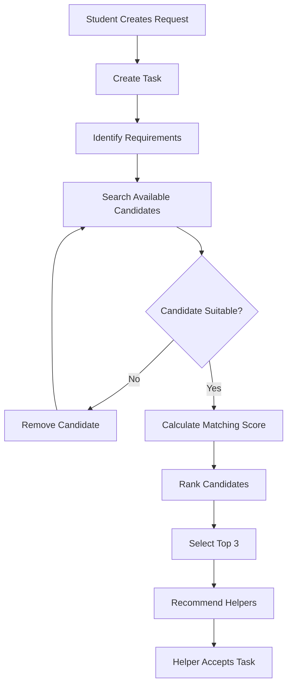

# CampusShare — User Flow

## 1. Overview

This document describes how a CampusShare request moves from a student request to a suitable helper recommendation.

```text
Student
   ↓
Create Request
   ↓
Task Created
   ↓
Identify Requirements
   ↓
Search Candidates
   ↓
Filter Candidates
   ↓
Calculate Matching Score
   ↓
Rank Candidates
   ↓
Top 3 Recommendations
   ↓
Helper Accepts Task
```

## 2. Detailed User Flow

### Step 1 — Student Creates a Request

A student creates a request on CampusShare.

Example:

```text
"I need a calculator near Block A from 2 PM to 4 PM."
```

### Step 2 — Task is Created

The request is converted into a task containing relevant information.

```text
Task Type: Resource Sharing
Resource: Calculator
Location: Block A
Time: 2 PM - 4 PM
Reward: Specified by requester
```

### Step 3 — Requirements are Identified

The matching system identifies:
- Category
- Location
- Availability
- Task Type
- Reward

### Step 4 — Candidate Search

The system searches for students who can provide the requested resource or service.

Example:

```text
Student A → Has calculator → Available
Student B → Has calculator → Available
Student C → Has notebook → Available
Student D → Has calculator → Not available
```

### Step 5 — Candidate Filtering

Unsuitable candidates are removed.

```text
Student C → Wrong category → Removed
Student D → Not available → Removed
```

Remaining candidates:

```text
Student A
Student B
```

### Step 6 — Matching Score

The system calculates a score for each remaining candidate.

```text
Student A → 95
Student B → 85
```

### Step 7 — Ranking

Candidates are ranked according to their matching score.

```text
1. Student A → 95
2. Student B → 85
```

### Step 8 — Recommendation

The system recommends suitable helpers.

Example:

```text
Recommended Helper:

Student A
Match Score: 95%

Why?
✓ Has the required calculator
✓ Available from 2 PM to 4 PM
✓ Located near Block A
```

### Step 9 — Helper Accepts

The selected helper can accept the task.

After acceptance, the system can continue toward payment and task completion in later stages.

## 3. Flowchart



## 4. Example End-to-End Flow

### Request

```text
"I need a laptop near the library tomorrow afternoon."
```

### Extracted Requirements

```text
Category: Laptop
Location Preference: Library
Availability: Tomorrow afternoon
Task Type: Resource Sharing
```

### Candidate Matching

```text
Candidate A:
Laptop ✓
Near Library ✓
Available ✓
Score = 100

Candidate B:
Laptop ✓
Far from Library
Available ✓
Score = 80

Candidate C:
No Laptop ✗
Candidate removed
```

### Final Recommendation

```text
1. Candidate A — 100%
2. Candidate B — 80%
```

The system should provide the recommendation together with the reason for the ranking.

## 5. Future Agentic Flow

```text
Natural Language Request
          ↓
Agent Parses Request
          ↓
Extract Requirements
          ↓
Search Candidates
          ↓
Apply Matching Rules
          ↓
Rank Candidates
          ↓
Explain Recommendations
          ↓
Return Top 3 Helpers
```
